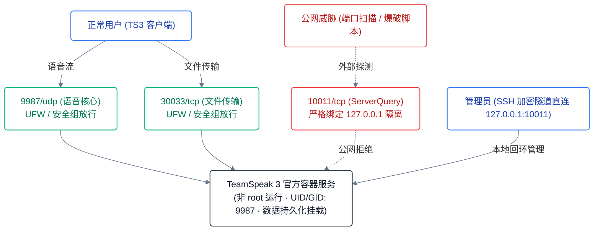

<div align="center">

# TeamSpeak 3 Server VPS 一键部署

**面向 Linux VPS 的轻量、安全加固版 TeamSpeak 3 容器化部署脚本**

基于 Docker Compose 编排，默认本地回环隔离 ServerQuery 管理面。<br>
支持国内源自动降级、密码内存注入防泄漏、权限自动修复与无损幂等更新。

[](LICENSE)
[](scripts/install-teamspeak3-server.sh)
[](https://docs.docker.com/compose/)
[](https://teamspeak.com)
[](#环境要求与目录)
[](#关键决策)

[English](README_EN.md) · [LINUX DO 社区讨论](https://linux.do/)

</div>

---

## 快速开始

### 1. 一键安装
在 VPS 终端以 root 权限执行：

```bash
curl -fsSL https://raw.githubusercontent.com/s1oopX/teamspeak3-vps-oneclick/main/scripts/install-teamspeak3-server.sh -o install-teamspeak3-server.sh
sudo bash install-teamspeak3-server.sh
```

> **无交互/自动化安装**：
> ```bash
> sudo TS3_SERVER_PASSWORD="YourPassword" bash install-teamspeak3-server.sh
> ```

### 2. 客户端连接
* **服务器地址**：`你的 VPS 公网 IP`
* **语音端口**：`9987`（UDP）
* **密码**：安装时设置的密码（未设置则留空）

### 3. 获取管理员 Token
首次进入服务器会提示输入**特权密钥 (Privilege Key)**，部署完成时会提示显示；亦可随时在 VPS 执行以下命令提取：
```bash
sudo docker logs teamspeak3 2>&1 | grep -Ei 'token|privilege' | grep -Eiv 'serveradmin|password'
```

---

## 端口与安全基线

| 协议 | 端口 | 暴露范围 | 用途与安全策略 |
|---|---|---|---|
| **UDP** | `9987` | **公网放行** | 语音连接（云安全组与 UFW 必需开放） |
| **TCP** | `30033`| **公网放行** | 客户端文件传输 / 图标上传 |
| **TCP** | `10011`| **仅 127.0.0.1** | ServerQuery 底层管理接口（**严禁公网暴露**，防撞库提权） |



---

## 关键决策

| 决策 | 选择 | 否决方案 | 代价与收益 |
|---|---|---|---|
| **管理面安全** | 强制 `127.0.0.1:10011` 本地监听 | 监听 `0.0.0.0` 全网暴露 | 远程管理需走 SSH 隧道，但彻底规避 ServerQuery 撞库攻击 |
| **密码注入** | 启动后通过 Python Socket 动态下发 | 写入 `.env` 或启动命令参数 | 依赖 Python3，但实现密码零落盘、进程参数无暴露 |
| **镜像拉取** | `docker manifest` 探测 + 国内加速源回退 | 硬编码官方单一镜像源 | 增加 2 秒预检耗时，彻底解决国内 VPS 拉取超时/中断问题 |
| **权限对齐** | 部署期前置 `chown 9987:9987` 挂载目录 | 容器内以 root 特权运行 | 宿主机普通用户读写需提权，但保证容器最小权限与数据可写 |
| **误操作防御**| 规范化路径 `readlink -m` + 根目录黑名单 | 直接执行 `rm -rf $DIR` | 增加路径校验逻辑，杜绝变量为空时误删系统核心目录 |

---

## 常用运维指令

项目部署目录位于 `/opt/teamspeak3-docker`：

```bash
# 查看服务状态
sudo docker compose --project-name teamspeak3 --env-file /opt/teamspeak3-docker/.env -f /opt/teamspeak3-docker/compose.yaml ps

# 查看实时日志
sudo docker compose --project-name teamspeak3 --env-file /opt/teamspeak3-docker/.env -f /opt/teamspeak3-docker/compose.yaml logs -f --tail=100

# 重启服务
sudo docker compose --project-name teamspeak3 --env-file /opt/teamspeak3-docker/.env -f /opt/teamspeak3-docker/compose.yaml restart
```

### 一键系统与健康巡检
一键核验环境兼容性、端口监听、UFW 状态、容器指标与日志排错：
```bash
curl -fsSL https://raw.githubusercontent.com/s1oopX/teamspeak3-vps-oneclick/main/checks/check-teamspeak3-server.sh -o check-teamspeak3-server.sh
sudo bash check-teamspeak3-server.sh
```

### 安全访问 ServerQuery（如使用 YatQA）
由于端口未暴露公网，可在本地电脑通过 SSH 隧道连接：
```bash
ssh -N -L 10011:127.0.0.1:10011 root@<VPS_IP>
```
连接后在管理软件填入 `127.0.0.1:10011` 即可。

### 卸载服务
```bash
curl -fsSL https://raw.githubusercontent.com/s1oopX/teamspeak3-vps-oneclick/main/scripts/uninstall-teamspeak3-server.sh -o uninstall-teamspeak3-server.sh

# 仅删除容器，保留数据库与语音数据
sudo bash uninstall-teamspeak3-server.sh

# 彻底清理（同时清除所有持久化数据）
sudo TS3_REMOVE_DATA=true bash uninstall-teamspeak3-server.sh
```

---

## 环境要求与目录

* **支持系统**：Ubuntu 22.04 / 24.04 LTS、Debian 12（推荐 `linux/amd64` 架构）
* **依赖工具**：Docker Engine、Docker Compose v2 插件、`sudo`/`root` 权限

```text
/opt/teamspeak3-docker/
├── .env                  # 运行时配置（端口/镜像/目录参数）
├── compose.yaml          # Docker Compose 编排文件
└── data/                 # 持久化挂载目录（UID:GID 9987）
    ├── files/            # 频道上传文件
    ├── logs/             # TS3 运行日志
    └── ts3server.sqlitedb# 核心 SQLite 数据库
```

---

## 许可

本项目基于 [MIT License](LICENSE) 开源。
